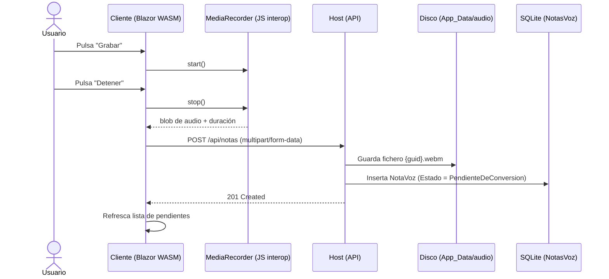
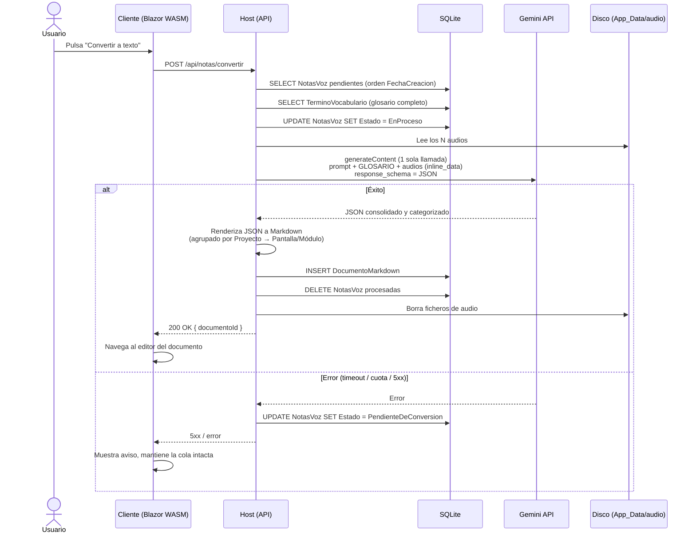
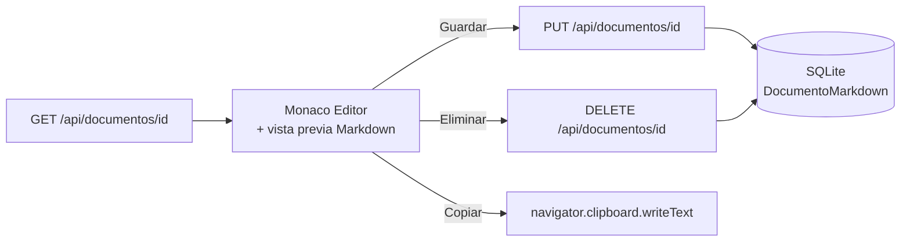

# Arquitectura y Diseño Técnico — Notas de Voz Inteligentes

**Versión:** 1.0
**Fecha:** 2026-06-10
**Ámbito:** Aplicación mono usuario, sin autenticación multiusuario.

---

## 1. Introducción

Este documento define la arquitectura y el diseño técnico de **Notas de Voz Inteligentes**, una aplicación web que permite capturar notas de voz a lo largo del día de forma asíncrona. Posteriormente, bajo demanda del usuario, las notas se procesan en conjunto con la API de Gemini para:

1. Generar transcripciones limpias (sin titubeos, muletillas ni repeticiones).
2. Resolver contradicciones entre notas (una nota posterior puede anular o modificar una anterior).
3. Categorizar el contenido por **Proyecto** y por **Pantalla / Clase / Servicio / Módulo**.
4. Producir un documento estructurado en **Markdown**, editable desde la propia aplicación con Monaco Editor.

Adicionalmente, la aplicación mantiene un **vocabulario personalizado** (CRUD) con términos propios del usuario —nombres de proyectos, productos o tecnologías como *opstream* o *todopedia*— que se envía a Gemini junto con las notas para evitar errores de transcripción (*mismatch*) en palabras que no existen en el vocabulario general del modelo.

---

## 2. Visión General de la Arquitectura

La solución sigue el modelo **Blazor Web App con render interactivo WebAssembly**: un host ASP.NET Core que sirve la aplicación, expone la API y accede a la base de datos, y un cliente Blazor WebAssembly que se ejecuta en el navegador.

```
┌─────────────────────────────────────────────────────────────────┐
│                          NAVEGADOR                               │
│  ┌───────────────────────────────────────────────────────────┐  │
│  │       NotasVozInteligentes.Client (Blazor WASM)            │  │
│  │                                                            │  │
│  │  • Grabadora de voz (MediaRecorder vía JS interop)         │  │
│  │  • Lista de notas pendientes                               │  │
│  │  • Botón "Convertir a texto"                               │  │
│  │  • Editor Markdown (Monaco Editor)                         │  │
│  │  • Gestión de vocabulario personalizado (CRUD)             │  │
│  └────────────────────────────┬──────────────────────────────┘  │
└───────────────────────────────┼──────────────────────────────────┘
                          HTTP / JSON
                                │
┌───────────────────────────────▼──────────────────────────────────┐
│            NotasVozInteligentes (Host ASP.NET Core)               │
│                                                                   │
│  ┌──────────────┐  ┌────────────────┐  ┌─────────────────────┐   │
│  │ Minimal API  │  │ Servicios de   │  │ GeminiService        │   │
│  │ /api/notas   │─▶│ dominio        │─▶│ (cliente HTTP de la  │   │
│  │ /api/docs    │  │                │  │  API de Gemini)      │   │
│  └──────┬───────┘  └───────┬────────┘  └──────────┬──────────┘   │
│         │                  │                       │              │
│  ┌──────▼──────────────────▼───────┐               │              │
│  │ EF Core (code first) + SQLite   │        ┌──────▼──────────┐  │
│  │  • NotaVoz                      │        │  Google Gemini   │  │
│  │  • Documento Markdown           │        │  API (externa)   │  │
│  │  • TerminoVocabulario           │        └─────────────────┘  │
│  └─────────────────────────────────┘                             │
│                                                                   │
│  Almacenamiento de audio: sistema de ficheros (App_Data/audio)   │
└──────────────────────────────────────────────────────────────────┘
```

### 2.1 Estructura de la solución

| Proyecto | Tipo | Responsabilidad |
|---|---|---|
| `src/NotasVozInteligentes` | ASP.NET Core (host) | Sirve la app Blazor, expone la API REST, EF Core + SQLite, integración con Gemini, almacenamiento de audio. |
| `src/NotasVozInteligentes.Client` | Blazor WebAssembly | UI interactiva: grabación, listado, conversión y edición Markdown. |

El cliente WASM **nunca** accede directamente a la base de datos ni a la API de Gemini: toda la lógica sensible (clave de API, persistencia) reside en el host.

### 2.2 Organización interna propuesta (host)

```
src/NotasVozInteligentes/
├── Components/              # App.razor, páginas server-side (Error, etc.)
├── Data/
│   ├── AppDbContext.cs      # DbContext EF Core
│   └── Migrations/          # Migraciones code first
├── Endpoints/
│   ├── NotasEndpoints.cs    # /api/notas
│   ├── DocumentosEndpoints.cs # /api/documentos
│   └── VocabularioEndpoints.cs # /api/vocabulario
├── Models/
│   ├── NotaVoz.cs
│   ├── DocumentoMarkdown.cs
│   └── TerminoVocabulario.cs
├── Services/
│   ├── IAudioStorage.cs / FileSystemAudioStorage.cs
│   ├── IGeminiService.cs / GeminiService.cs
│   └── IConversionService.cs / ConversionService.cs
└── Program.cs

src/NotasVozInteligentes.Client/
├── Pages/
│   ├── Home.razor           # Grabación + lista de notas pendientes
│   ├── Documento.razor      # Editor Markdown (Monaco)
│   └── Vocabulario.razor    # CRUD de términos del vocabulario
├── Services/
│   └── ApiClient.cs         # HttpClient tipado contra /api
└── Interop/
    ├── audioRecorder.js     # MediaRecorder
    └── monacoEditor.js      # Inicialización de Monaco
```

---

## 3. Tecnologías

| Capa | Tecnología | Notas |
|---|---|---|
| Frontend | Blazor Interactive WebAssembly (.NET 10) | Render mode `InteractiveWebAssembly` ya configurado en `Program.cs`. |
| Grabación de audio | API `MediaRecorder` del navegador | Vía JS interop; formato `audio/webm` (Opus) o `audio/mp4` según navegador. |
| Editor | Monaco Editor | Cargado como asset estático; integración por JS interop. Lenguaje `markdown`. |
| Backend | ASP.NET Core Minimal API | Mismo host que sirve el cliente WASM. |
| Persistencia | Entity Framework Core (code first) + SQLite | Fichero `notas.db` local; migraciones automáticas al arrancar. |
| IA | Google Gemini API (`gemini-2.x`, endpoint `generateContent`) | Modelo multimodal: recibe los audios directamente y devuelve JSON estructurado. |
| Audio en disco | Sistema de ficheros (`App_Data/audio/`) | En BD solo se guarda la ruta/nombre del fichero, no el blob. |

---

## 4. Modelo de Datos

EF Core code first con SQLite. Tres entidades principales:

### 4.1 `NotaVoz`

| Campo | Tipo | Descripción |
|---|---|---|
| `Id` | `Guid` (PK) | Identificador de la nota. |
| `FechaCreacion` | `DateTimeOffset` | Momento de la grabación. Relevante para resolver contradicciones (la más reciente prevalece). |
| `RutaAudio` | `string` | Ruta relativa del fichero en `App_Data/audio/`. |
| `MimeType` | `string` | `audio/webm`, `audio/mp4`, etc. |
| `DuracionSegundos` | `double?` | Duración estimada (informativa, para la UI). |
| `Estado` | `enum EstadoNota` | `PendienteDeConversion`, `EnProceso`. |

> Las notas convertidas **no** se conservan: tras una conversión satisfactoria se eliminan de la base de datos y del disco (ver §5.2). Por eso no existe estado `Convertida`.

### 4.2 `DocumentoMarkdown`

| Campo | Tipo | Descripción |
|---|---|---|
| `Id` | `Guid` (PK) | Identificador del documento. |
| `Titulo` | `string` | Título visible (por defecto, fecha de generación). |
| `Contenido` | `string` | Markdown completo. |
| `FechaCreacion` | `DateTimeOffset` | Generación inicial. |
| `FechaModificacion` | `DateTimeOffset` | Última edición manual. |

### 4.3 `TerminoVocabulario`

Vocabulario personalizado que se inyecta en el prompt de Gemini para que los términos propios del usuario se transcriban correctamente.

| Campo | Tipo | Descripción |
|---|---|---|
| `Id` | `Guid` (PK) | Identificador del término. |
| `Termino` | `string` | Grafía correcta del término (ej. `opstream`, `todopedia`). Único (índice `UNIQUE`, comparación sin distinción de mayúsculas). |
| `Descripcion` | `string?` | Contexto opcional para Gemini (ej. *"opstream: nombre de un proyecto de streaming interno"*). Mejora la desambiguación. |
| `FechaCreacion` | `DateTimeOffset` | Alta del término. |

### 4.4 `AppDbContext`

```csharp
public class AppDbContext(DbContextOptions<AppDbContext> options) : DbContext(options)
{
    public DbSet<NotaVoz> NotasVoz => Set<NotaVoz>();
    public DbSet<DocumentoMarkdown> Documentos => Set<DocumentoMarkdown>();
    public DbSet<TerminoVocabulario> Vocabulario => Set<TerminoVocabulario>();
}
```

Registro en `Program.cs`:

```csharp
builder.Services.AddDbContext<AppDbContext>(o =>
    o.UseSqlite(builder.Configuration.GetConnectionString("Default")
        ?? "Data Source=App_Data/notas.db"));
```

Al arrancar, `dbContext.Database.Migrate()` aplica las migraciones pendientes (aceptable por ser mono usuario / instancia única).

---

## 5. Flujo de Trabajo

### 5.1 Paso 1 — Captura de notas de voz



Detalles:

* La grabación se hace íntegramente en el cliente con `MediaRecorder` (JS interop). No se usa streaming: la nota se sube completa al detener la grabación.
* El audio **no** se guarda como blob en SQLite, solo su ruta. Esto mantiene la BD ligera y simplifica el envío posterior a Gemini.
* La página principal muestra la cola de notas pendientes (fecha, duración) con opción de reproducirlas y eliminarlas individualmente antes de convertir.

### 5.2 Paso 2 — Conversión y estructuración (bajo demanda)

El usuario pulsa **"Convertir a texto"** → `POST /api/notas/convertir`.



**Análisis global, no nota a nota.** Es un requisito clave: una nota puede contradecir o anular otra anterior ("olvida lo que dije del login, mejor con Microsoft"). Por ello todos los audios viajan en **una sola llamada** a `generateContent` y el prompt instruye explícitamente:

> *"Las notas están ordenadas cronológicamente. Si una nota posterior contradice, corrige o anula una anterior, prevalece la más reciente y la información anulada no debe aparecer en el resultado."*

**Vocabulario personalizado contra el mismatch.** El audio puede contener términos inventados o internos (*opstream*, *todopedia*…) que un modelo de transcripción tendería a sustituir por palabras reales parecidas ("upstream", "Wikipedia"). Para evitarlo, el prompt incluye un glosario construido desde la tabla `TerminoVocabulario`:

> *"GLOSARIO — Los siguientes términos son nombres propios del usuario y deben transcribirse EXACTAMENTE con esta grafía cuando se pronuncien o se pronuncie algo fonéticamente similar; no los sustituyas por palabras parecidas del idioma:*
> *- opstream: nombre de un proyecto de streaming interno*
> *- todopedia: nombre de un producto"*

El glosario viaja en cada conversión, de modo que cualquier alta o corrección en el vocabulario surte efecto en la siguiente llamada sin necesidad de reentrenar ni configurar nada más.

**Esquema de respuesta solicitado a Gemini** (mediante `response_schema`):

```json
{
  "proyectos": [
    {
      "nombre": "Alpha",
      "elementos": [
        {
          "nombre": "Pantalla de login",
          "tipo": "Pantalla",
          "tareas": [
            "Añadir autenticación con Google."
          ]
        }
      ]
    }
  ],
  "sinClasificar": [ "..." ]
}
```

Las notas que Gemini no logre asociar a ningún proyecto van a `sinClasificar`, que se renderiza al final del documento bajo un epígrafe propio; así nunca se pierde contenido.

**Markdown generado** (ejemplo):

```markdown
# Notas — 10/06/2026

## Proyecto Alpha

### Pantalla de login
- Añadir autenticación con Google.

## Proyecto Beta

### Pantalla de perfil
- Incluir el campo fecha de nacimiento.

## Sin clasificar
- Llamar al gestor para renovar el dominio.
```

**Manejo de errores:** si la llamada a Gemini falla (timeout, cuota, error 5xx), las notas se devuelven al estado `PendienteDeConversion` y **no** se elimina nada. El borrado de audios y filas solo ocurre tras persistir el documento con éxito. El orden es: *guardar documento → borrar filas → borrar ficheros*; un fallo al borrar ficheros se registra en log pero no revierte la conversión (un audio huérfano en disco es inocuo).

### 5.3 Paso 3 — Visualización y edición



* El cliente carga el documento (`GET /api/documentos/{id}`) y lo abre en **Monaco Editor** configurado con lenguaje `markdown`, ajuste de línea y tema acorde a la app.
* Junto al editor se ofrece una **vista previa renderizada** del Markdown (pestaña o panel dividido).
* Acciones disponibles:
  * **Guardar** → `PUT /api/documentos/{id}` (actualiza `Contenido` y `FechaModificacion`).
  * **Eliminar** → `DELETE /api/documentos/{id}` (con confirmación).
  * **Copiar al portapapeles** → `navigator.clipboard.writeText` vía JS interop; copia el Markdown íntegro.
* Existe un listado histórico de documentos generados (`GET /api/documentos`), ya que cada conversión produce un documento nuevo.

---

## 6. API REST

Minimal API en el host, prefijo `/api`. Sin autenticación (mono usuario, despliegue local/personal).

| Método | Ruta | Descripción | Respuesta |
|---|---|---|---|
| `POST` | `/api/notas` | Sube una nota de voz (multipart: fichero + duración). | `201` + `NotaVozDto` |
| `GET` | `/api/notas` | Lista notas pendientes de conversión. | `200` + `NotaVozDto[]` |
| `GET` | `/api/notas/{id}/audio` | Devuelve el fichero de audio (para reproducirlo en la UI). | `200` (stream) |
| `DELETE` | `/api/notas/{id}` | Descarta una nota sin convertirla. | `204` |
| `POST` | `/api/notas/convertir` | Procesa globalmente todas las pendientes con Gemini. | `200` + `{ documentoId }` |
| `GET` | `/api/documentos` | Lista documentos generados. | `200` + `DocumentoDto[]` |
| `GET` | `/api/documentos/{id}` | Obtiene un documento. | `200` + `DocumentoDto` |
| `PUT` | `/api/documentos/{id}` | Guarda la edición del Markdown. | `204` |
| `DELETE` | `/api/documentos/{id}` | Elimina un documento. | `204` |
| `GET` | `/api/vocabulario` | Lista los términos del vocabulario. | `200` + `TerminoDto[]` |
| `POST` | `/api/vocabulario` | Crea un término (rechaza duplicados con `409`). | `201` + `TerminoDto` |
| `PUT` | `/api/vocabulario/{id}` | Modifica término o descripción. | `204` |
| `DELETE` | `/api/vocabulario/{id}` | Elimina un término. | `204` |

DTOs compartidos entre cliente y servidor en una carpeta `Shared` del proyecto cliente (referenciado por el host), evitando duplicación.

---

## 7. Integración con Gemini

### 7.1 Servicio

`GeminiService` encapsula la llamada HTTP a `https://generativelanguage.googleapis.com/v1beta/models/{modelo}:generateContent`:

* **Modelo:** configurable (`Gemini:Model`, por defecto un modelo multimodal con soporte de audio, p. ej. `gemini-2.5-flash`). Gemini acepta audio nativo, por lo que **no hace falta un paso previo de speech-to-text**: transcripción, limpieza y estructuración ocurren en una sola llamada.
* **Audios:** se envían como `inline_data` (base64 + `mime_type`). Límite práctico de ~20 MB por petición en inline; si la suma de audios lo supera, el servicio usa la **File API** de Gemini (subida previa + referencia `file_data`).
* **Salida estructurada:** `generationConfig.response_mime_type = "application/json"` junto con `response_schema`, lo que garantiza JSON parseable sin heurísticas.
* **Glosario de vocabulario:** `ConversionService` lee la tabla `TerminoVocabulario` y la serializa como sección `GLOSARIO` dentro del prompt de sistema (término + descripción). Es texto plano de pocos cientos de tokens, por lo que su impacto en coste/latencia es despreciable.
* **Resiliencia:** reintentos con backoff exponencial (3 intentos) ante 429/5xx, vía `HttpClient` tipado + `Microsoft.Extensions.Http.Resilience`.

### 7.2 Configuración y secretos

```jsonc
// appsettings.json (sin secretos)
{
  "ConnectionStrings": { "Default": "Data Source=App_Data/notas.db" },
  "Gemini": {
    "Model": "gemini-2.5-flash"
    // ApiKey NUNCA aquí
  }
}
```

La clave de API se provee por **User Secrets** en desarrollo (`dotnet user-secrets set Gemini:ApiKey ...`) o variable de entorno `Gemini__ApiKey` en despliegue. Al residir solo en el host, la clave jamás llega al navegador.

---

## 8. Frontend (Blazor WebAssembly)

### 8.1 Páginas

| Página | Ruta | Contenido |
|---|---|---|
| `Home.razor` | `/` | Botón de grabación, cola de pendientes con reproducción/borrado, botón **Convertir a texto** con indicador de progreso. |
| `Documentos.razor` | `/documentos` | Listado histórico de documentos. |
| `Documento.razor` | `/documentos/{id}` | Monaco Editor + vista previa + acciones (guardar, eliminar, copiar). |
| `Vocabulario.razor` | `/vocabulario` | CRUD de términos: tabla con búsqueda, alta/edición en línea (término + descripción) y borrado con confirmación. Valida duplicados mostrando el `409` del servidor. |

### 8.2 JS Interop

* **`audioRecorder.js`**: encapsula `getUserMedia` + `MediaRecorder`. Expone `start()`, `stop()` (devuelve el blob) y `getDuration()`. Maneja la denegación de permisos de micrófono mostrando un aviso en la UI.
* **`monacoEditor.js`**: crea/destruye la instancia de Monaco, sincroniza el contenido con Blazor mediante callbacks (`onDidChangeModelContent` con debounce) y expone `getValue()`/`setValue()`.
* **Portapapeles**: módulo mínimo sobre `navigator.clipboard`.

### 8.3 Estado y UX

* `ApiClient` (HttpClient tipado) centraliza las llamadas a `/api`.
* La conversión puede tardar decenas de segundos: la UI deshabilita el botón, muestra spinner con mensaje ("Analizando N notas…") y al terminar navega automáticamente al documento.
* Aviso de cambios sin guardar al abandonar el editor (interceptación de navegación de Blazor).

---

## 9. Decisiones de Diseño y Justificación

| Decisión | Alternativa descartada | Justificación |
|---|---|---|
| Audio en sistema de ficheros, ruta en BD | Blob en SQLite | BD ligera; el fichero se lee una vez para enviarlo a Gemini y luego se borra. |
| Una sola llamada global a Gemini con todos los audios | Transcribir nota a nota y consolidar después | Requisito funcional: resolver contradicciones exige contexto global. Además ahorra llamadas. |
| Audio nativo a Gemini (multimodal) | STT previo (Whisper, etc.) + LLM | Menos piezas, menos latencia total, y Gemini limpia titubeos directamente desde el audio. |
| Borrar las notas tras convertir | Conservarlas con estado `Convertida` | Requisito explícito del flujo (paso 2.3). El documento Markdown es la fuente de verdad posterior. |
| Vocabulario como glosario en el prompt | *Fine-tuning* / diccionario de corrección post-transcripción | Sin coste de entrenamiento y efecto inmediato al editar el CRUD; Gemini corrige por contexto fonético, cosa que un find-replace posterior no puede hacer de forma fiable. |
| Minimal API en el mismo host | Proyecto API separado / gRPC | Mono usuario, una sola unidad de despliegue; Blazor WASM ya necesita un host ASP.NET Core. |
| `Database.Migrate()` al arrancar | Scripts de migración manuales | Instancia única y SQLite local: la migración automática es segura y simplifica el despliegue. |
| Sin autenticación | Identity / OAuth | Aplicación mono usuario de uso personal. Si se expone fuera de localhost, bastará anteponer autenticación básica o un reverse proxy con auth. |

---

## 10. Consideraciones Transversales

* **Concurrencia:** el estado `EnProceso` actúa de cerrojo lógico para impedir conversiones simultáneas; el endpoint `convertir` responde `409 Conflict` si ya hay una en curso.
* **Logging:** `ILogger` estándar; se registran tamaño/número de audios enviados, latencia de Gemini y errores de parseo del JSON de respuesta (nunca la clave de API ni el contenido completo de las notas en nivel `Information`).
* **Backups:** la BD es un único fichero SQLite (`App_Data/notas.db`); basta copiarlo. Los audios pendientes están en `App_Data/audio/`.
* **Límites:** si el número/tamaño de audios excede la ventana de entrada del modelo, el servicio trocea en lotes cronológicos y encadena las llamadas pasando el resultado parcial como contexto del lote siguiente (caso límite, no flujo habitual).

---

## 11. Evolución Futura (fuera de alcance v1)

* PWA con grabación offline y sincronización al recuperar conexión.
* Exportación a otros destinos (issues de GitHub, Notion, correo).
* Multiusuario con autenticación, si la herramienta se comparte.
